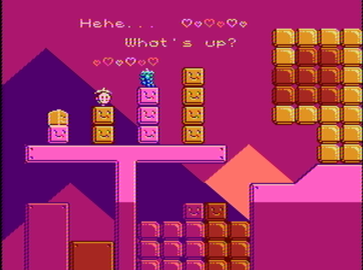

# Winter

A uh...... nes game yeah

Actually, originally it was going to be an top down exploration game with a plot but
now it looks like some kinda platformer involving musical notes :DDDD

## How to Build

u will need these: `ca65` and `ld65` and `make`

then run this: `make`

## Directories

`build/` where the .nes goes when you `make` it
`src/` the source code yeah
`cfg/` config files for the assembler
`chr/` character rom files
`pal/` color palettes
`nam/` name tables
`map/` level map data
`bin/` misc binary files
